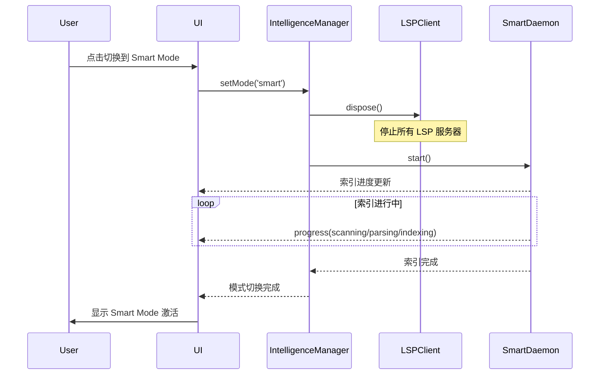
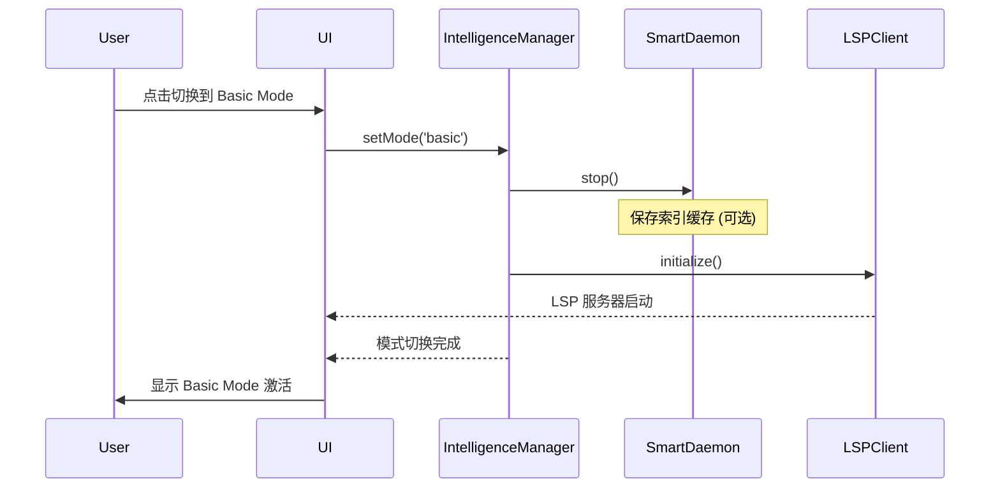

# 智能模式切换机制设计

## 概述

Logos IDE 支持两种代码智能模式，用户可以根据需求和场景在两者之间切换：

| 模式 | 特点 | 适用场景 |
|------|------|----------|
| **Basic** | 标准 LSP、轻量级、启动快 | 快速编辑、大型项目、资源受限 |
| **Smart** | 全量索引、深度分析、高级重构 | 专业开发、复杂重构、代码审查 |

## UI 设计

### 状态栏指示器

```
┌──────────────────────────────────────────────────────────────────────┐
│ [文件] [编辑] [视图] ...                              [最小化][最大化][关闭] │
├──────────────────────────────────────────────────────────────────────┤
│                                                                       │
│                         (编辑器区域)                                   │
│                                                                       │
├──────────────────────────────────────────────────────────────────────┤
│ main ↑2 ↓0 | TypeScript | UTF-8 | LF | Ln 42, Col 15 | [⚡ Smart] │
└──────────────────────────────────────────────────────────────────────┘
                                                          ↑
                                                    模式指示器
```

### 模式切换菜单

点击模式指示器时显示：

```
┌─────────────────────────────────┐
│ ○ Basic Mode                    │
│   Standard LSP                  │
│   ✓ Fast startup                │
│   ✓ Low memory usage            │
│                                 │
│ ● Smart Mode                    │
│   Full indexing                 │
│   ✓ Advanced refactoring        │
│   ✓ Call hierarchy              │
│   ✓ Impact analysis             │
│                                 │
├─────────────────────────────────┤
│ ⚙ Auto-select based on project │
│                                 │
│ Project Analysis:               │
│ Files: 1,234                    │
│ Est. Memory: 256MB              │
│ Languages: TypeScript, Python   │
│ → Small project - Basic Mode    │
└─────────────────────────────────┘
```

### 索引进度指示器 (Smart Mode)

首次打开项目或切换到 Smart Mode 时：

```
┌─────────────────────────────────────────────────────┐
│ ⚡ Indexing project...                              │
│ ████████████░░░░░░░░░░░░░░░░░░░░░░░░░░░░░░  35%     │
│ src/services/lsp/IntelligenceManager.ts             │
│ 1,234 / 3,567 files                                 │
└─────────────────────────────────────────────────────┘
```

## 状态管理

### Store 定义

```typescript
// src/stores/intelligence.ts
import { defineStore } from 'pinia'
import { getIntelligenceManager, type IntelligenceMode } from '@/services/lsp/IntelligenceManager'

export interface IndexingProgress {
  phase: 'idle' | 'scanning' | 'parsing' | 'indexing' | 'ready'
  message: string
  currentFile?: string
  processedFiles: number
  totalFiles: number
  percentage: number
}

export const useIntelligenceStore = defineStore('intelligence', {
  state: () => ({
    mode: 'basic' as IntelligenceMode,
    autoSelect: true,
    indexingProgress: null as IndexingProgress | null,
    serverStatus: {} as Record<string, string>,
  }),

  getters: {
    isSmartMode: (state) => state.mode === 'smart',
    isIndexing: (state) => state.indexingProgress?.phase === 'indexing',
    isReady: (state) => state.mode === 'basic' || state.indexingProgress?.phase === 'ready',
  },

  actions: {
    async setMode(mode: IntelligenceMode) {
      const manager = getIntelligenceManager()
      await manager.setMode(mode)
      this.mode = mode
    },

    async toggleMode() {
      await this.setMode(this.mode === 'basic' ? 'smart' : 'basic')
    },

    setIndexingProgress(progress: IndexingProgress) {
      this.indexingProgress = progress
    },

    setAutoSelect(enabled: boolean) {
      this.autoSelect = enabled
      if (enabled) {
        this.autoDetectMode()
      }
    },

    async autoDetectMode() {
      // 根据项目特征自动选择模式
      const projectInfo = await this.analyzeProject()

      if (projectInfo.fileCount > 5000 || projectInfo.estimatedMemory > 2048) {
        // 大型项目默认使用 Basic
        await this.setMode('basic')
      } else if (projectInfo.hasComplexDependencies) {
        // 复杂依赖关系的项目使用 Smart
        await this.setMode('smart')
      } else {
        // 默认使用 Basic
        await this.setMode('basic')
      }
    },

    async analyzeProject(): Promise<ProjectAnalysis> {
      try {
        // 通过主进程 IPC 分析项目（文件数/总大小/语言/依赖复杂度）
        if (window.electronAPI?.intelligence?.analyzeProject) {
          return await window.electronAPI.intelligence.analyzeProject()
        }
      } catch (error) {
        console.error('Failed to analyze project:', error)
      }

      // fallback：返回默认值（不会阻塞 UI）
      return {
        fileCount: 0,
        totalSize: 0,
        estimatedMemory: 0,
        hasComplexDependencies: false,
        languages: [],
      }
    }
  },
})
```

## 切换流程

### 1. Basic → Smart



### 2. Smart → Basic



## 状态栏组件

```vue
<!-- src/components/StatusBar/IntelligenceModeIndicator.vue -->
<template>
  <div class="intelligence-mode" @click="showMenu = !showMenu">
    <!-- 模式图标 -->
    <mdui-icon :name="modeIcon"></mdui-icon>

    <!-- 模式名称 -->
    <span class="mode-label">{{ modeLabel }}</span>

    <!-- 索引进度 (Smart Mode) -->
    <mdui-linear-progress
      v-if="isIndexing"
      :value="indexingProgress?.percentage || 0"
      class="indexing-progress"
    />

    <!-- 模式切换菜单 -->
    <mdui-menu v-if="showMenu" class="mode-menu">
      <mdui-menu-item
        :selected="mode === 'basic'"
        @click="setMode('basic')"
      >
        <mdui-icon slot="icon" name="flash_off"></mdui-icon>
        <span>Basic Mode</span>
        <span slot="description">Standard LSP - Fast & lightweight</span>
      </mdui-menu-item>

      <mdui-menu-item
        :selected="mode === 'smart'"
        @click="setMode('smart')"
      >
        <mdui-icon slot="icon" name="flash_on"></mdui-icon>
        <span>Smart Mode</span>
        <span slot="description">Full indexing - Advanced features</span>
      </mdui-menu-item>

      <mdui-divider></mdui-divider>

      <mdui-menu-item>
        <mdui-checkbox
          :checked="autoSelect"
          @change="toggleAutoSelect"
        ></mdui-checkbox>
        <span>Auto-select based on project</span>
      </mdui-menu-item>
    </mdui-menu>
  </div>
</template>

<script setup lang="ts">
import { computed, ref } from 'vue'
import { useIntelligenceStore } from '@/stores/intelligence'

const store = useIntelligenceStore()
const showMenu = ref(false)

const mode = computed(() => store.mode)
const autoSelect = computed(() => store.autoSelect)
const isIndexing = computed(() => store.isIndexing)
const indexingProgress = computed(() => store.indexingProgress)

const modeIcon = computed(() => {
  if (isIndexing.value) return 'sync'
  return mode.value === 'smart' ? 'flash_on' : 'flash_off'
})

const modeLabel = computed(() => {
  if (isIndexing.value) {
    return `Indexing ${indexingProgress.value?.percentage || 0}%`
  }
  return mode.value === 'smart' ? 'Smart' : 'Basic'
})

async function setMode(newMode: 'basic' | 'smart') {
  showMenu.value = false
  await store.setMode(newMode)
}

function toggleAutoSelect() {
  store.setAutoSelect(!autoSelect.value)
}
</script>

<style scoped>
.intelligence-mode {
  display: flex;
  align-items: center;
  gap: 4px;
  cursor: pointer;
  padding: 0 8px;
  height: 100%;
}

.intelligence-mode:hover {
  background: var(--mdui-color-surface-container);
}

.mode-label {
  font-size: 12px;
}

.indexing-progress {
  width: 60px;
  height: 4px;
}

.mode-menu {
  position: absolute;
  bottom: 100%;
  right: 0;
}
</style>
```

## 自动切换策略

### 内存压力检测

```typescript
// 监控内存使用，必要时降级到 Basic Mode
class MemoryMonitor {
  private readonly threshold = 0.85 // 85% 内存使用率

  start() {
    setInterval(() => {
      const usage = process.memoryUsage()
      const heapUsed = usage.heapUsed / usage.heapTotal

      if (heapUsed > this.threshold) {
        const store = useIntelligenceStore()
        if (store.mode === 'smart') {
          console.warn('[MemoryMonitor] High memory usage, switching to Basic mode')
          store.setMode('basic')
        }
      }
    }, 30000) // 每 30 秒检查一次
  }
}
```

### 项目规模检测

```typescript
interface ProjectAnalysis {
  fileCount: number
  totalSize: number
  estimatedMemory: number
  hasComplexDependencies: boolean
  languages: string[]
}

async function analyzeProject(rootPath: string): Promise<ProjectAnalysis> {
  // 统计文件数量
  const files = await scanFiles(rootPath)

  // 估算内存需求 (约 1KB/文件 for symbol table)
  const estimatedMemory = files.length * 1024

  // 检查是否有复杂依赖
  const hasComplexDependencies = await checkDependencies(rootPath)

  return {
    fileCount: files.length,
    totalSize: files.reduce((sum, f) => sum + f.size, 0),
    estimatedMemory,
    hasComplexDependencies,
    languages: detectLanguages(files),
  }
}
```

### 索引完成自动切换

```typescript
// 当索引完成时自动从 Basic 切换到 Smart
intelligenceManager.onIndexingComplete(() => {
  const store = useIntelligenceStore()
  if (store.mode === 'basic' && store.pendingSmartSwitch) {
    store.setMode('smart')
    store.pendingSmartSwitch = false
  }
})
```

## 设置持久化

### 自动保存模式

模式切换会自动保存到 localStorage，包括：
- 当前选择的模式（Basic/Smart）
- 自动选择开关状态
- Smart Mode 阈值配置

```typescript
// 在 intelligence store 的 setMode 方法中自动持久化
async setMode(mode: IntelligenceMode) {
  // ... 切换逻辑 ...

  // 保存设置到 localStorage
  if (typeof window !== 'undefined' && window.localStorage) {
    try {
      const settingsKey = 'lsp-ide-settings'
      const savedSettings = localStorage.getItem(settingsKey)
      if (savedSettings) {
        const settings = JSON.parse(savedSettings)
        if (!settings.lsp) settings.lsp = {}
        settings.lsp.mode = mode
        localStorage.setItem(settingsKey, JSON.stringify(settings))
      }
    } catch (error) {
      console.error('Failed to persist intelligence mode:', error)
    }
  }
}
```

### 应用启动时恢复

应用启动时会自动恢复上次的模式设置：

```typescript
// src/App.vue - onMounted
onMounted(async () => {
  // 从设置初始化智能模式
  await intelligenceStore.initFromSettings(settingsStore.lspMode)
  // ...
})
```

### 首次启动对话框

首次启动时显示 LSP 设置对话框，用户选择的模式会立即生效：

```typescript
// src/components/LSPSetupDialog.vue
const handleConfirm = async () => {
  // 保存设置
  settingsStore.setLSPMode(selectedMode.value)
  // 立即应用模式（同步到 intelligence store）
  await intelligenceStore.setMode(selectedMode.value)
  settingsStore.dismissLSPSetup()
}
```

对话框 UI 优化特性：
- 增强背景色对比度，使用不透明的 surface 颜色
- 模式卡片有明显的边框和阴影效果
- 改进文本可读性和间距
- 代码示例带边框，易于辨认

## 项目分析与自动切换

### 项目分析

打开项目时自动分析项目规模：

```typescript
// src/views/EditorView.vue
if (fileExplorerStore.rootPath) {
  await intelligenceManager.openProject(fileExplorerStore.rootPath)

  // 分析项目并根据 autoSelect 决定是否自动切换模式
  if (intelligenceStore.autoSelect) {
    await intelligenceStore.autoDetectMode()
  } else {
    // 即使不自动切换，也分析项目以显示信息
    await intelligenceStore.analyzeProject()
  }
}
```

### 自动切换规则

```typescript
async autoDetectMode() {
  const analysis = await this.analyzeProject()
  this.projectAnalysis = analysis

  if (
    analysis.fileCount > this.smartModeThreshold.maxFiles ||
    analysis.estimatedMemory > this.smartModeThreshold.maxMemoryMB
  ) {
    // 大型项目默认使用 Basic（超过 5000 文件或 2048MB）
    await this.setMode('basic')
  } else if (analysis.hasComplexDependencies) {
    // 复杂依赖关系的项目使用 Smart
    await this.setMode('smart')
  } else {
    // 默认使用 Basic (快速启动)
    await this.setMode('basic')
  }
}
```

### 项目分析信息显示

状态栏模式指示器菜单中会显示项目分析结果：

```typescript
// src/components/StatusBar/IntelligenceModeIndicator.vue
const getRecommendation = () => {
  const analysis = intelligenceStore.projectAnalysis
  if (!analysis) return ''

  if (analysis.fileCount > intelligenceStore.smartModeThreshold.maxFiles) {
    return `Large project (${analysis.fileCount} files) - Basic Mode recommended`
  }
  if (analysis.estimatedMemory > intelligenceStore.smartModeThreshold.maxMemoryMB) {
    return `High memory usage (${analysis.estimatedMemory}MB) - Basic Mode recommended`
  }
  if (analysis.hasComplexDependencies) {
    return 'Complex dependencies detected - Smart Mode recommended'
  }
  return 'Small project - Basic Mode for fast startup'
}
```

## Monaco 编辑器诊断优化

### 禁用内置 TypeScript 诊断

为避免 Monaco 内置诊断与 LSP/Smart Mode 诊断冲突，在编辑器初始化时禁用内置检查：

```typescript
// src/views/EditorView.vue - initEditor()
function initEditor() {
  // 禁用 Monaco 内置的 TypeScript 诊断（避免与 LSP/Smart Mode 冲突）
  monaco.languages.typescript.typescriptDefaults.setDiagnosticsOptions({
    noSemanticValidation: true,
    noSyntaxValidation: true,
    noSuggestionDiagnostics: true
  })

  monaco.languages.typescript.javascriptDefaults.setDiagnosticsOptions({
    noSemanticValidation: true,
    noSyntaxValidation: true,
    noSuggestionDiagnostics: true
  })

  // ... 其余初始化代码
}
```

这样可以确保：
- 只显示来自 LSP/Smart Mode 的诊断信息
- 避免重复或冲突的错误提示
- 语法高亮红线与实际分析结果一致

## 设置持久化

```typescript
// 保存用户偏好
interface IntelligenceSettings {
  defaultMode: 'basic' | 'smart' | 'auto'
  autoSelect: boolean
  smartModeThreshold: {
    maxFiles: number
    maxMemoryMB: number
  }
}

// 从 localStorage 读取设置
function loadSettings(): IntelligenceSettings {
  const saved = localStorage.getItem('intelligence-settings')
  if (saved) {
    return JSON.parse(saved)
  }
  return {
    defaultMode: 'auto',
    autoSelect: true,
    smartModeThreshold: {
      maxFiles: 5000,
      maxMemoryMB: 2048,
    },
  }
}

// 保存设置
function saveSettings(settings: IntelligenceSettings) {
  localStorage.setItem('intelligence-settings', JSON.stringify(settings))
}
```

## 命令面板集成

```typescript
// 注册命令
registerCommand('intelligence.switchToBasic', async () => {
  await useIntelligenceStore().setMode('basic')
})

registerCommand('intelligence.switchToSmart', async () => {
  await useIntelligenceStore().setMode('smart')
})

registerCommand('intelligence.toggleMode', async () => {
  await useIntelligenceStore().toggleMode()
})
```

## 快捷键

| 快捷键 | 操作 |
|--------|------|
| `Ctrl/Cmd+Shift+I` | 切换智能模式 |
| `Ctrl/Cmd+Shift+B` | 切换到 Basic Mode |
| `Ctrl/Cmd+Shift+M` | 切换到 Smart Mode |

## 实现计划

### Phase 1: 基础切换 ✅
- [x] IntelligenceManager 模式切换逻辑
- [x] Basic Mode LSP 集成
- [x] 模式状态管理 (`src/stores/intelligence.ts`)

### Phase 2: UI 组件 ✅
- [x] 状态栏模式指示器 (`src/components/StatusBar/IntelligenceModeIndicator.vue`)
- [x] 模式切换菜单 (下拉菜单)
- [x] 索引进度显示 (进度条)
- [x] 快捷键支持 (Ctrl/Cmd+Shift+I/B/M)

### Phase 3: 自动策略 ✅
- [x] 项目规模分析 (analyzeProject API)
- [x] 内存压力监控 (`electron/services/memoryMonitorService.ts`)
- [x] 自动模式选择 (`src/stores/intelligence.ts` - handleAutoDowngrade)

### Phase 4: 设置与持久化 ✅
- [x] 用户偏好设置 (通过 settingsStore.lspMode)
- [x] 自动保存模式切换到 localStorage
- [x] 应用启动时自动恢复上次模式
- [x] LSP 设置对话框 (`src/components/LSPSetupDialog.vue`)
- [x] 项目分析信息展示
- [x] UI 可读性优化
- [x] 项目级别设置 (`electron/services/projectSettingsService.ts`)

## 已实现的组件

### 前端组件

**`src/stores/intelligence.ts`**
- `IntelligenceMode`: 'basic' | 'smart'
- `IndexingProgress`: 索引进度状态
- `setMode()`: 切换模式
- `toggleMode()`: 切换模式
- `initFromSettings()`: 从设置初始化

**`src/components/StatusBar/IntelligenceModeIndicator.vue`**
- 显示当前模式 (Basic/Smart)
- 索引进度条
- 下拉菜单切换模式
- 自动选择开关

**`src/App.vue`**
- 快捷键处理 (Ctrl/Cmd+Shift+I/B/M)
- 索引进度订阅
- LSP 服务器状态显示

**`src/components/Intelligence/CallHierarchyPanel.vue`**
- 调用链追踪 UI
- 支持入站/出站调用切换
- 树形结构展示调用关系

**`src/components/Intelligence/ImpactAnalysisPanel.vue`**
- 影响分析 UI
- 显示直接/间接影响
- 风险级别评估

**`src/stores/callHierarchy.ts`**
- 调用链状态管理
- 支持展开/折叠、导航

**`src/stores/impactAnalysis.ts`**
- 影响分析状态管理
- 分组显示、历史记录

### 后端 API

**`electron/preload.ts`**
```typescript
intelligence: {
  setMode(mode: 'basic' | 'smart'): Promise<void>
  analyzeProject(): Promise<ProjectAnalysis>
  // ... 其他 API
}
```

**`electron/services/intelligenceService.ts`**
- `intelligence:setMode` IPC 处理器
- `intelligence:analyzeProject` IPC 处理器

**`electron/services/memoryMonitorService.ts`**
- 内存使用监控
- 内存压力检测 (low/moderate/high/critical)
- 自动 GC 触发
- 降级建议通知

### Rust Daemon API

**`logos-daemon/src/state.rs`**
- `IntelligenceMode` 枚举 (Basic/Smart)
- `enable_smart_mode()` 启用 Smart 模式并开始索引
- `enable_basic_mode()` 切换回 Basic 模式
- `get_indexer()` 获取 ProjectIndexer

**`logos-daemon/src/handlers/mode.rs`**
- `logos/setMode` - 切换模式
- `logos/getMode` - 获取当前模式
- `logos/getIndexStats` - 获取索引统计

**`logos-daemon/src/handlers/call_hierarchy.rs`**
- `textDocument/prepareCallHierarchy` - 准备调用层级
- `callHierarchy/incomingCalls` - 获取调用者
- `callHierarchy/outgoingCalls` - 获取被调用者
